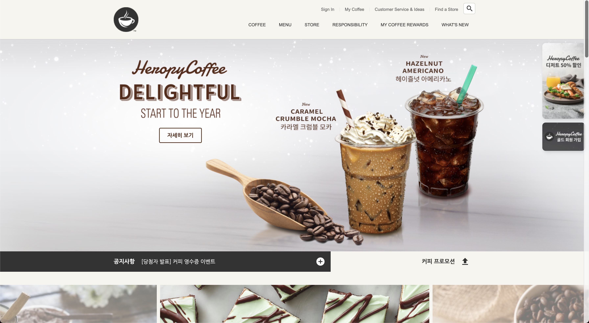

# ☕ CLONING WEBSITE OF COFFEE SHOP

web 코딩을 공부하면서 기본적인 html, css, js만을 사용하여 구현한 클론 웹사이트이다. framework를 사용하지 않았기에 대부분의 라이브러리는 CDN 방식으로 적용되었다. 

## 🔔 완성 이미지

## 📚 사용된 라이브러리

- #### Google Material Icons
  구글에서 제공하는 아이콘을 무료로 사용할 수 있다.
- #### GSAP & ScrollToPlugin
  GSAP(The GreenSock Animation Platform)은 js로 제어하는 타임라인 기반 animation 라이브러리이며, ScrollToPlugin은 스크롤 애니메이션을 지원하는 GSAP의 플러그인이다.
- #### Swiper
  하드웨어 가속 전환을 지원하는 슬라이드 라이브러리이다.
- #### Youtube API
  IFrame Player API를 통해 youtube 동영상을 제어할 수 있게 해주는 라이브러리이다.
- #### ScrollMagic
  스크롤과 element의 상호 작용을 위한 라이브러리이다.

## ⚙ 기술 스택

  
